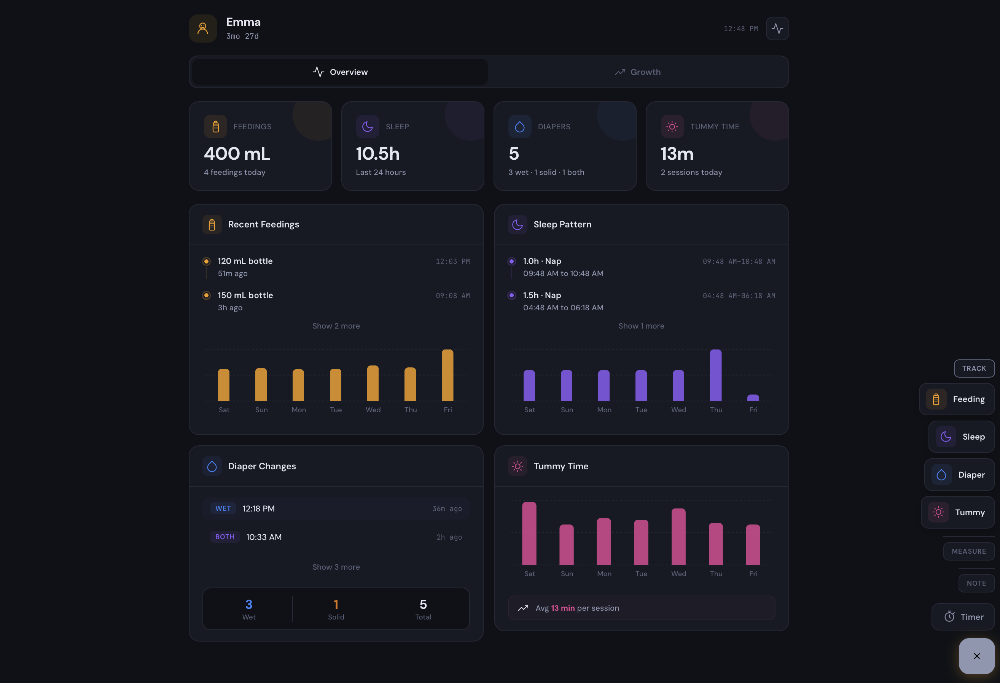
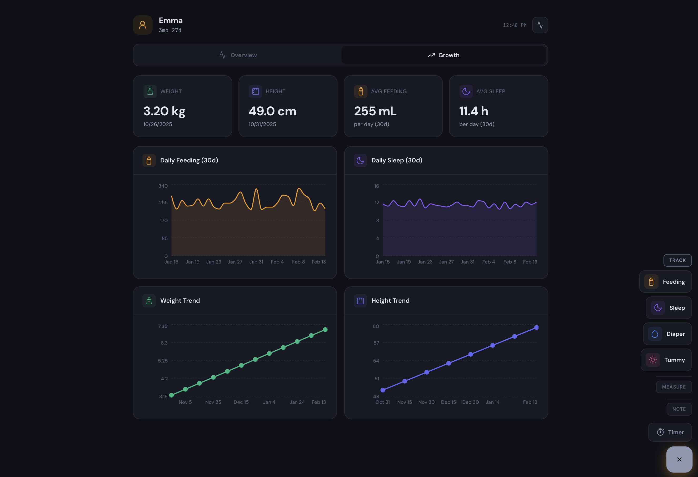

# Baby Buddy Dashboard

A modern, responsive dashboard for [Baby Buddy](https://github.com/babybuddy/babybuddy), built as a Home Assistant add-on. Provides a clean interface for viewing and logging baby care activities - feedings, sleep, diaper changes, tummy time, temperature, growth, and more.

  

## Screenshots

| Overview | Growth |
|----------|--------|
|  |  |

## Features

- **Overview dashboard** — daily stats, timelines, and charts for feedings, sleep, diapers, and tummy time
- **Growth tracking** — 30-day feeding totals, sleep averages, weight, and height trend charts
- **Quick logging** — grouped floating action button to quickly log feedings, sleep, diaper changes, tummy time, temperature, weight, height, and notes
- **Multiple timers** — run concurrent timers for overlapping activities (feeding, sleep, tummy time)
- **Metric / Imperial** — configurable unit labels (kg/lb, cm/in, mL/oz, °C/°F) with no data conversion
- **Demo mode** — built-in mock data to preview the dashboard without a Baby Buddy instance
- **Auto-refresh** — configurable polling interval keeps the dashboard up to date
- **Dark theme** — designed for always-on displays and low-light nursery use
- **Responsive** — works on desktop, tablet, and phone screens

## Architecture

```
┌─────────────┐       ┌──────────────┐       ┌─────────────┐
│  Browser    │──────▶│  FastAPI     │──────▶│ Baby Buddy  │
│ (React SPA) │◀──────│  Backend     │◀──────│   API       │
└─────────────┘       └──────────────┘       └─────────────┘
     :5173                 :8099
  (dev only)          (proxy + static)
```

- **Frontend** — React 18 + Vite, with Recharts for data visualization
- **Backend** — FastAPI (Python) proxy server that authenticates with Baby Buddy's API and serves the React SPA
- **Deployment** — Docker container as a Home Assistant add-on, or run locally for development

The backend acts as an API proxy so the Baby Buddy API key stays server-side and is never exposed to the browser.

## Home Assistant Add-on Installation

1. In Home Assistant, go to **Settings > Add-ons > Add-on Store**
2. Click the **three dots** (top right) > **Repositories**
3. Add this repository URL:
   ```
   https://github.com/mbentancour/baby-buddy-dashboard
   ```
4. Find **Baby Buddy Dashboard** in the store and click **Install**
5. Configure the add-on:
   - **Baby Buddy URL** — full URL to your instance (e.g., `http://192.168.1.100:8000`)
   - **API Key** — found in Baby Buddy under *Settings > API Key*
   - **Refresh Interval** — polling interval in seconds (default: 30)
   - **Unit System** — `metric` or `imperial` (labels only, no conversion)
   - **Demo Mode** — enable to preview with mock data (no Baby Buddy required)
6. Start the add-on — the dashboard appears in the Home Assistant sidebar

## Local Development

### Prerequisites

- Node.js (18+)
- Python 3.10+
- A running Baby Buddy instance

### Setup

1. Copy the example environment file and fill in your Baby Buddy connection details:

   ```bash
   cp .env.example .env
   ```

   Then edit `.env`:

   ```
   BABY_BUDDY_URL=http://192.168.1.100:8000
   BABY_BUDDY_API_KEY=your_api_key_here
   REFRESH_INTERVAL=30
   UNIT_SYSTEM=metric
   ```

2. Run the development servers:

   ```bash
   ./run_local.sh
   ```

   This starts:
   - **Backend** (FastAPI) on `http://localhost:8099` — proxies API requests to Baby Buddy
   - **Frontend** (Vite dev server) on `http://localhost:5173` — hot-reloads on code changes

3. Open `http://localhost:5173` in your browser

The script auto-installs npm and pip dependencies on first run. Press `Ctrl+C` to stop both servers.

> **Note:** `.env` is gitignored so your credentials are never committed.

### Building for production

```bash
cd baby-buddy-dashboard/frontend
npm run build
```

The built files are output to `baby-buddy-dashboard/frontend/dist/`.

## Project Structure

This repository follows the [Home Assistant add-on repository](https://developers.home-assistant.io/docs/add-ons/repository/) layout — each add-on lives in its own subdirectory.

```
baby-buddy-dashboard/               # ← repository root
├── repository.yaml                  # HA add-on repository metadata
├── README.md
├── LICENSE
├── .env.example                     # Environment variable template (local dev)
├── .gitignore
├── run_local.sh                     # Local development script (sources .env)
│
└── baby-buddy-dashboard/            # ← the add-on
    ├── config.yaml                  # Home Assistant add-on config
    ├── Dockerfile
    ├── build.yaml                   # Docker multi-arch build config
    ├── run.sh                       # Production entry script (Home Assistant)
    ├── translations/
    │   └── en.yaml                  # HA config UI labels
    ├── backend/
    │   ├── server.py                # FastAPI app — API proxy + static file server
    │   └── requirements.txt         # Python dependencies
    └── frontend/
        ├── index.html               # Entry HTML
        ├── vite.config.js           # Vite config with API proxy for dev
        ├── package.json
        └── src/
            ├── main.jsx             # React entry point
            ├── App.jsx              # Main app shell — layout, tabs, modals, FAB
            ├── styles.css           # Global styles, CSS variables, animations
            ├── api.js               # API client for all Baby Buddy endpoints
            ├── hooks/
            │   ├── useBabyData.js   # Fetches and polls all baby data
            │   └── useTimers.js     # Timer state management
            ├── tabs/
            │   ├── OverviewTab.jsx  # Daily stats, timelines, and charts
            │   └── GrowthTab.jsx    # Weight, height, feeding & sleep trends
            ├── components/
            │   ├── Icons.jsx        # SVG icon components
            │   ├── StatCard.jsx     # Stat display card
            │   ├── SectionCard.jsx  # Section container with header
            │   ├── TimelineItem.jsx # Timeline entry
            │   ├── TimerButton.jsx  # Timer start/stop button
            │   ├── DiaperBadge.jsx  # Diaper type badge
            │   ├── CustomTooltip.jsx # Chart tooltip
            │   ├── Modal.jsx        # Modal + form primitives
            │   └── forms/
            │       ├── FeedingForm.jsx
            │       ├── SleepForm.jsx
            │       ├── DiaperForm.jsx
            │       ├── TemperatureForm.jsx
            │       ├── TummyTimeForm.jsx
            │       ├── WeightForm.jsx
            │       ├── HeightForm.jsx
            │       └── NoteForm.jsx
            └── utils/
                ├── colors.js        # Color palette
                ├── units.js         # Unit system context (metric/imperial)
                ├── mockData.js      # Demo mode mock data generator
                └── formatters.js    # Date, time, and data formatting
```

## Configuration

| Setting | Description | Default |
|---------|-------------|---------|
| `baby_buddy_url` | Full URL to your Baby Buddy instance | — |
| `baby_buddy_api_key` | Baby Buddy API token | — |
| `refresh_interval` | Polling interval in seconds (5–300) | 30 |
| `unit_system` | Unit labels: `metric` (kg, cm, mL, °C) or `imperial` (lb, in, oz, °F) | metric |
| `demo_mode` | Show mock data without connecting to Baby Buddy | false |

### Getting your API key

1. Open your Baby Buddy instance
2. Go to **Settings** (or `/user/settings/`)
3. Find the **API Key** section
4. Copy the token string

## Baby Buddy API Notes

This dashboard uses Baby Buddy's REST API. A few important details about the filter parameters:

- Endpoints with `start`/`end` fields (feedings, sleep, tummy times) use `start_min`/`start_max` for date filtering
- Endpoints with a `time` field (diaper changes, temperature) use `date_min`/`date_max`
- All date filters expect **ISO 8601 datetime strings** (e.g., `2025-01-15T00:00:00`), not plain dates
- Datetimes should be in **local time without a timezone suffix** so Baby Buddy interprets them in its configured timezone

## License

This project is licensed under the [MIT License](LICENSE). You are free to use, modify, and distribute it. See the LICENSE file for the full text.
